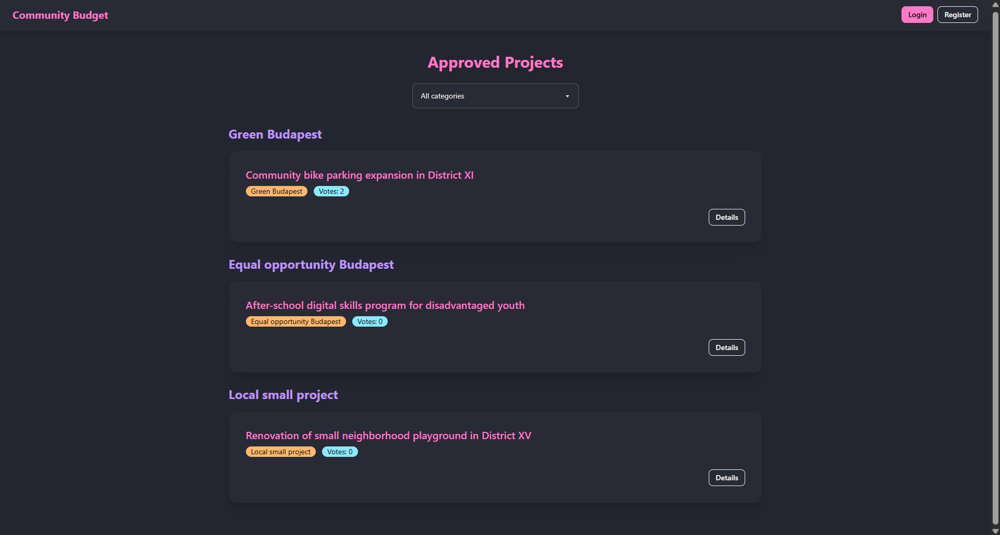
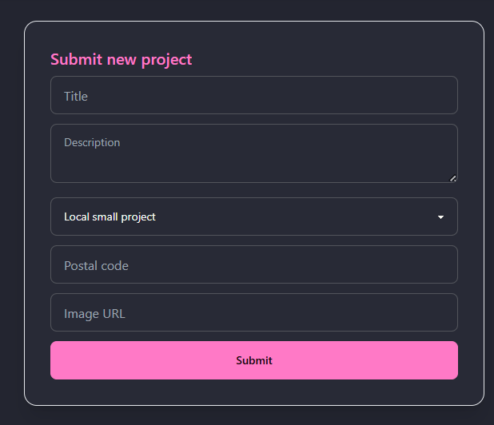
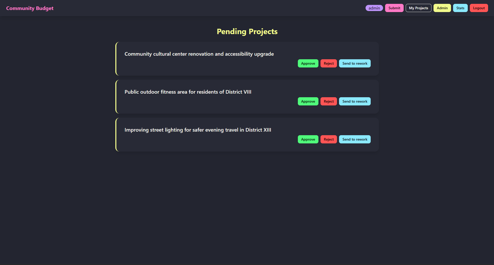
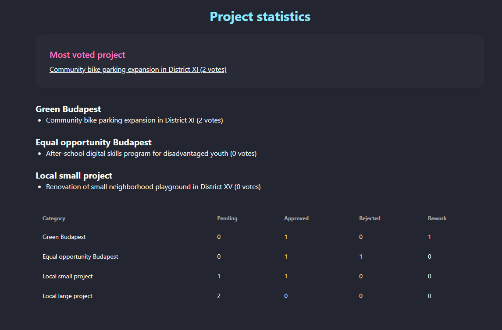
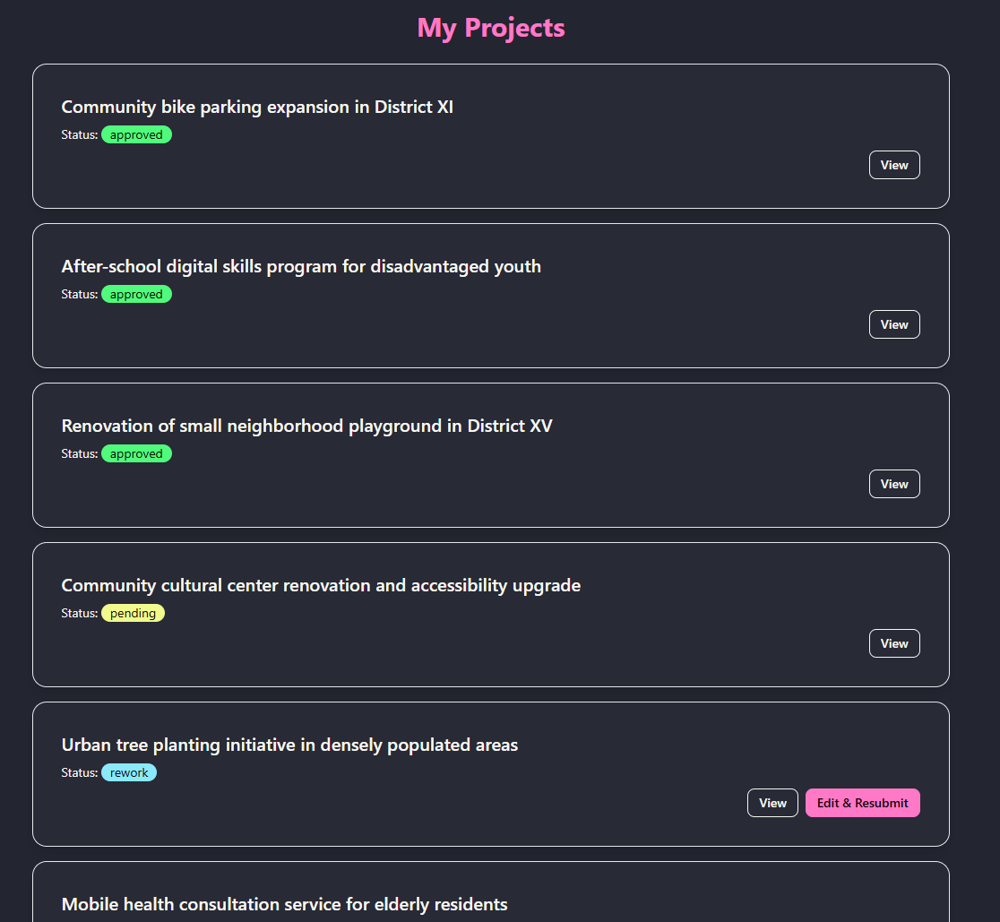

# Budapest Community Budget (PHP)

A PHP-based web application for submitting, reviewing, publishing, and voting on community budget project proposals for Budapest.

This project was developed as part of the **Web Programming course** and implements a complete proposal submission and voting workflow using **vanilla PHP**, **sessions**, **JSON-based storage**, and **AJAX/Fetch** for asynchronous voting.

## Overview

The application allows residents to submit project ideas for Budapest’s community budget and vote on approved proposals.

There are three main user roles:

- **Guest** – can browse approved projects, filter them by category, and view project details
- **Logged-in user** – can submit project ideas and vote on published projects
- **Admin** – can review pending projects, approve or reject them, send them back for rework, and access statistics

## Main Features

### Project listing
- Approved projects are displayed on the homepage
- Projects are grouped and filterable by category
- Each project shows its current vote count
- Clicking a project opens its detail page

### Authentication
- Registration with:
  - unique username
  - valid email
  - password confirmation
- Login/logout support
- Passwords stored as hashes
- Admin account supported

### Project submission
- Logged-in users can submit new projects
- Validation rules include:
  - title minimum 10 characters
  - description minimum 150 characters
  - category selected from predefined options
  - valid Budapest postal code
  - optional valid image URL

### Voting
- Logged-in users can vote on approved projects
- Voting is limited to:
  - maximum 3 votes per category
  - only 1 vote per project
- Users can withdraw votes during the voting period
- Voting closes 2 weeks after project publication
- AJAX/Fetch is used for voting without full page reload

### Project moderation
- Admin can review pending projects
- Admin can:
  - approve a project
  - reject a project
  - send it back for rework with comment
- Users can edit rework projects and resubmit them

### Statistics
- Admin can access project statistics
- Includes:
  - project with the highest vote count
  - top 3 projects in each category
  - project counts grouped by category and status

## Technologies Used

- PHP (vanilla, no framework)
- JavaScript (AJAX / Fetch only)
- HTML
- CSS
- Sessions
- JSON file storage

## Project Structure

```
php_assignment/
├── index.php
├── project.php
├── projects-own.php
├── projects-admin.php
├── statistics.php
├── submit_project.php
├── login.php
├── register.php
├── logout.php
├── auth.php
├── menu.php
├── storage.php
├── process_login.php
├── process_register.php
├── process_project.php
├── process_vote.php
├── process_admin_action.php
├── projects.json
├── users.json
├── votes.json
├── .gitignore
└── README.md
```

## Pages

### `index.php`

Homepage showing approved projects, grouped by category, with filtering and voting.

### `project.php`

Detailed page for a single project.

### `projects-own.php`

Shows the logged-in user's submitted projects and their statuses.

### `projects-admin.php`

Admin page for reviewing pending submissions.

### `statistics.php`

Admin statistics page.

### `submit_project.php`

Form for submitting new project proposals.

### `login.php` / `register.php`

Authentication pages.

## Validation Rules

### Registration

* username must be unique
* username cannot contain spaces
* email must be valid
* password must be at least 8 characters
* password must contain lowercase, uppercase, and numeric characters
* password confirmation must match

### Project submission

* title must be at least 10 characters
* description must be at least 150 characters
* category must be selected from fixed categories
* postal code must match Budapest format
* image URL is optional but must be valid if provided

## Fixed Categories

* Local small project
* Local large project
* Equal opportunity Budapest
* Green Budapest

## Voting Rules

* a user can vote once per project
* a user can cast at most 3 votes per category
* votes can be withdrawn only while voting is still open
* voting closes 14 days after publication

## Admin Features

* review pending proposals
* approve or reject projects
* return projects for rework with comment
* view voting statistics
* view top-voted projects by category

## Screenshots

Add screenshots in a `screenshots/` folder, for example:

```
screenshots/
├── home-page.png
├── submit-project.png
├── own-projects.png
├── admin-page.png
├── project-detail.png
└── statistics-page.png
```

Then show them like this:


## Screenshots

### Homepage


### Submit Project


### Admin Page


### Statistics


### My Projects


## How to Run

Run the project in a local PHP server environment such as:

* XAMPP
* Laragon
* PHP built-in server

Example with PHP built-in server:

```
php -S localhost:8000
```

Then open:

```
http://localhost:8000/index.php
```

## Notes

* This project uses **JSON files instead of a database**
* PHP frameworks were **not used**
* Voting uses **AJAX/Fetch**
* Authentication is session-based

## Author

**Hasanli Jafar**
Computer Science Student
Eötvös Loránd University (ELTE)
## Academic Note

This project was created as an individual university assignment for the Web Programming course.
